# CloudSecure Infrastructure Project

## 🎯 Project Overview

A production-ready, secure cloud infrastructure implementing defense-in-depth security architecture with VPC isolation, encrypted storage, comprehensive monitoring, and audit logging.

**Project Duration:** February 11-13, 2026 (3 days)  
**Status:** ✅ Complete  
**Technologies:** AWS VPC, EC2, S3, CloudWatch, CloudTrail, SNS, IAM, Terraform

---

## 📋 Table of Contents

- [Visual Architecture](#-visual-architecture)
- [Project Summary](#-project-summary)
- [Infrastructure Components](#-infrastructure-components)
- [Security Controls](#-security-controls)
- [Monitoring & Alerting](#-monitoring--alerting)
- [Infrastructure as Code](#️-infrastructure-as-code)
- [Testing & Validation](#-testing--validation)
- [Key Learnings](#-key-learnings)
- [Challenges & Solutions](#-challenges--solutions)
- [Project Outcomes](#-project-outcomes)
- [Getting Started](#-getting-started)

---

## 📊 Visual Architecture

### System Overview

```mermaid
graph TB
    Internet["🌐 Internet"]
    IGW["🚪 Internet Gateway"]

    Internet -->|HTTPS/HTTP| IGW

    subgraph AWS["☁️ AWS Account: 103976430153"]
        subgraph VPC["VPC: 10.0.0.0/16"]
            subgraph Public["Public Subnet: 10.0.1.0/24"]
                Web["🌐 Web Server<br/>Public: 44.200.32.245<br/>Private: 10.0.1.x<br/>Encrypted EBS ✅"]
                Bastion["🔐 Bastion Host<br/>Public: 3.228.6.170<br/>SSH Jump Server<br/>Encrypted EBS ✅"]
            end
            subgraph Private["Private Subnet: 10.0.2.0/24"]
                App["⚙️ App Server<br/>NO Public IP 🔒<br/>Private: 10.0.2.x<br/>Encrypted EBS ✅"]
            end
        end
        subgraph Monitor["Monitoring"]
            CW["📊 CloudWatch<br/>Logs + Alarms"]
        end
        subgraph Store["Storage"]
            S3["🗄️ S3 Bucket<br/>Encrypted ✅<br/>Versioning ✅<br/>Public Access Blocked ✅"]
        end
    end

    IGW --> Web
    IGW --> Bastion
    Bastion -->|SSH Jump| App
    Web -->|App Traffic| App
    Web --> S3
    App --> S3
    CW --> Web
    CW --> App

    style Internet fill:#4a90d9,color:#ffffff
    style IGW fill:#e8820c,color:#ffffff
    style Public fill:#ffdddd,color:#000000
    style Private fill:#ddeeff,color:#000000
    style Monitor fill:#fff0dd,color:#000000
    style Store fill:#ddffdd,color:#000000
    style Web fill:#ffffff,color:#000000
    style Bastion fill:#ffffff,color:#000000
    style App fill:#ffffff,color:#000000
    style CW fill:#ffffff,color:#000000
    style S3 fill:#ffffff,color:#000000
```



---

### Network Traffic Flow

```mermaid
sequenceDiagram
    participant User as 👤 User
    participant IGW as 🚪 Internet Gateway
    participant Web as 🌐 Web Server
    participant App as ⚙️ App Server
    participant S3 as 🗄️ S3 Bucket

    User->>IGW: HTTP Request (port 80)
    IGW->>Web: Forward to Web Server
    Web->>Web: Security Group Check ✅
    Web->>App: Forward to App Server
    App->>App: Security Group Check ✅
    Note over App: Only Web Server SG allowed!
    App->>S3: Read/Write Data
    S3-->>App: Return Data (Encrypted)
    App-->>Web: Response
    Web-->>User: Return Web Page
```



---

### Security Layers

```mermaid
graph TD
    Attack["🦹 Attack Attempt"]
    Attack --> L1{"Layer 1: Network ACL<br/>Subnet Level<br/>Allow: HTTP, HTTPS, SSH<br/>Deny: Everything else"}
    L1 -->|Blocked| Deny1["❌ Access Denied"]
    L1 -->|Passed| L2{"Layer 2: Security Group<br/>Instance Level<br/>Web SG: Allow 80, 443<br/>App SG: Web Server only<br/>Bastion SG: SSH only"}
    L2 -->|Blocked| Deny2["❌ Access Denied"]
    L2 -->|Passed| L3{"Layer 3: IAM Role<br/>Permission Level<br/>EC2 least privilege<br/>No wildcard permissions<br/>Specific ARNs only"}
    L3 -->|Blocked| Deny3["❌ Access Denied"]
    L3 -->|Passed| Access["✅ Access Granted<br/>Logged in CloudTrail"]

    style Attack fill:#ff6b6b,color:#ffffff
    style L1 fill:#ffcccc,color:#000000
    style L2 fill:#ffe8cc,color:#000000
    style L3 fill:#cce5ff,color:#000000
    style Deny1 fill:#ff4444,color:#ffffff
    style Deny2 fill:#ff4444,color:#ffffff
    style Deny3 fill:#ff4444,color:#ffffff
    style Access fill:#44bb44,color:#ffffff
```



---

### Bastion Host Access Pattern

```mermaid
graph LR
    You["💻 Your PC"]
    Bastion["🔐 Bastion Host<br/>3.228.6.170<br/>Public Subnet"]
    Web["🌐 Web Server<br/>10.0.1.x<br/>Public Subnet"]
    App["⚙️ App Server<br/>10.0.2.x<br/>Private Subnet"]

    You -->|"SSH (port 22)<br/>From your IP only"| Bastion
    Bastion -->|"SSH Jump<br/>Within VPC"| Web
    Bastion -->|"SSH Jump<br/>Within VPC"| App

    Internet["🌐 Internet"] -.->|"❌ BLOCKED<br/>No direct access"| App

    style App fill:#e6f3ff
    style Bastion fill:#fff0e6
```



---

## 💼 Project Summary

### Business Scenario

**CloudSecure Inc** needs to deploy a secure web application with:
- Public-facing web server accessible from internet
- Private application server isolated from internet
- Encrypted data storage with versioning
- 24/7 monitoring with automated alerts
- Complete audit trail of all AWS API calls
- Defense in depth with multiple security layers

### Solution Implemented

A multi-tier secure infrastructure with:
- **Network Isolation:** Public and private subnets in a custom VPC
- **Bastion Host Pattern:** Secure SSH access via jump server
- **Encryption Everywhere:** EBS volumes and S3 bucket encrypted at rest
- **IAM Least Privilege:** EC2 roles with specific permissions, no wildcards
- **Complete Monitoring:** CloudWatch + CloudTrail + VPC Flow Logs
- **Automated Alerting:** SNS email notifications for security events

---

## 🏗️ Infrastructure Components

### 1. VPC & Networking

**VPC Configuration:**
- **CIDR Block:** 10.0.0.0/16 (65,536 IP addresses)
- **DNS Hostnames:** Enabled
- **DNS Support:** Enabled

**Subnets:**

| Subnet | CIDR | Type | Purpose |
|--------|------|------|---------|
| Public Subnet | 10.0.1.0/24 | Public | Web server, Bastion host |
| Private Subnet | 10.0.2.0/24 | Private | App server, sensitive workloads |

**Routing:**
- Public Subnet: Route to Internet Gateway (0.0.0.0/0)
- Private Subnet: Local VPC traffic only (no internet route)

**Security:**
- Network ACLs on both subnets
- VPC Flow Logs capturing all traffic

---

### 2. EC2 Instances

| Instance | Subnet | Public IP | Purpose | Encryption |
|----------|--------|-----------|---------|------------|
| Web Server | Public | 44.200.32.245 | Serves web traffic | EBS Encrypted ✅ |
| Bastion Host | Public | 3.228.6.170 | SSH jump server | EBS Encrypted ✅ |
| App Server | Private | None 🔒 | Application logic | EBS Encrypted ✅ |

**Instance Details:**
- **Type:** t3.micro (Free Tier eligible)
- **OS:** Amazon Linux 2023
- **Storage:** 30GB gp3 SSD (encrypted)
- **IAM Roles:** Least privilege (no wildcards)

---

### 3. Security Groups

**Web Server SG:**
```
Inbound:
  ✅ Port 80  (HTTP)  - From: 0.0.0.0/0 (anyone)
  ✅ Port 443 (HTTPS) - From: 0.0.0.0/0 (anyone)
  ✅ Port 22  (SSH)   - From: Bastion SG only

Outbound:
  ✅ All traffic allowed
```

**Bastion SG:**
```
Inbound:
  ✅ Port 22 (SSH) - From: 0.0.0.0/0

Outbound:
  ✅ All traffic allowed
```

**App Server SG:**
```
Inbound:
  ✅ All traffic - From: Web Server SG only
  ✅ Port 22 (SSH) - From: Bastion SG only
  ❌ Everything else - BLOCKED

Outbound:
  ✅ All traffic allowed
```

---

### 4. S3 Bucket

**Bucket Name:** `cloudsecure-infrastructure-storage-hpbydy63`

**Security Configuration:**

| Feature | Status | Details |
|---------|--------|---------|
| Encryption | ✅ Enabled | AES-256 server-side encryption |
| Versioning | ✅ Enabled | All file versions preserved |
| Public Access | ✅ Blocked | All 4 public access settings blocked |
| Lifecycle Policy | ✅ Active | Old versions deleted after 30 days |

**Lifecycle Rules:**
- After 7 days: Move old versions to STANDARD_IA (cheaper storage)
- After 30 days: Delete old versions (cost management)

---

## 🔐 Security Controls

### Defense in Depth

**4 layers of security protecting every resource:**

```
Layer 1: Network ACL
→ Subnet-level firewall
→ Blocks unwanted traffic before reaching instances
→ Stateless rules (explicit allow/deny)

Layer 2: Security Groups  
→ Instance-level firewall
→ Web server: HTTP/HTTPS only
→ App server: Only web server can reach it
→ Stateful rules (return traffic automatic)

Layer 3: IAM Roles
→ API-level access control
→ EC2 instances have specific permissions only
→ No wildcard (*) permissions
→ Least privilege principle

Layer 4: Encryption
→ Data-level protection
→ All EBS volumes encrypted (AES-256)
→ S3 bucket encrypted (AES-256)
→ Data protected even if storage is compromised
```

---

### Private Subnet Isolation

**Why the app server is safe:**

```
Internet → ❌ CANNOT reach app server directly because:

1. No public IP assigned
2. No route to Internet Gateway in private subnet
3. Security group only allows web server SG
4. Network ACL restricts to VPC traffic only

Only way to reach app server:
Internet → Bastion (SSH) → App Server
Internet → Web Server → App Server
```

---

### IAM Least Privilege for EC2

**Web Server Role - Only what it needs:**
- ✅ Write to CloudWatch Logs (specific log group ARN)
- ✅ Read/Write to S3 bucket (specific bucket ARN)
- ✅ SSM Session Manager access
- ❌ Cannot access other S3 buckets
- ❌ Cannot create IAM users
- ❌ Cannot access billing

**App Server Role - Minimal permissions:**
- ✅ Write to security CloudWatch log group only
- ✅ SSM Session Manager access
- ❌ Cannot access S3
- ❌ Cannot access other AWS services

---

## 📊 Monitoring & Alerting

### CloudWatch Alarms

| Alarm | Threshold | Action |
|-------|-----------|--------|
| Web Server CPU High | > 80% for 4 minutes | Email alert via SNS |
| App Server CPU High | > 80% for 4 minutes | Email alert via SNS |
| Web Server Status Check Failed | Any failure | Email alert via SNS |

### CloudWatch Log Groups

| Log Group | Retention | Purpose |
|-----------|-----------|---------|
| /cloudsecure/application | 30 days | Application logs |
| /cloudsecure/security | 90 days | Security events |
| /cloudsecure/vpc-flow-logs | 30 days | Network traffic |

### CloudTrail

**What gets logged:**
- Every AWS API call in the account
- Who made the call (user/role)
- When it was made (timestamp)
- From where (IP address)
- What changed (before/after)

**Storage:** Encrypted S3 bucket with log file validation

**Use cases:**
- Security investigations
- Compliance auditing
- Detecting unauthorized access
- Troubleshooting permission issues

### VPC Flow Logs

**What gets captured:**
- Source and destination IPs
- Source and destination ports
- Protocol (TCP, UDP, ICMP)
- Traffic accepted or rejected
- Packet count and bytes

**Use cases:**
- Detect port scanning attacks
- Identify unusual traffic patterns
- Debug network connectivity issues
- Security incident investigation

### Alert Flow

```mermaid
graph LR
    EC2["🖥️ EC2 Instance"]
    CW["📊 CloudWatch<br/>Detects: CPU > 80%"]
    SNS["📢 SNS Topic"]
    Email["📧 Your Email<br/>Alert received!"]

    EC2 -->|Sends metrics| CW
    CW -->|Threshold breached| SNS
    SNS -->|Notification| Email

    style CW fill:#fff0e6
    style SNS fill:#ffe6e6
    style Email fill:#e6ffe6
```



---

## 🛠️ Infrastructure as Code

### Terraform File Structure

```
terraform/
├── providers.tf          # AWS + Random providers
├── variables.tf          # All configurable values
├── vpc.tf               # VPC, subnets, routing, NACLs, flow logs
├── security_groups.tf   # Bastion, web, app security groups
├── ec2.tf               # 3 EC2 instances with encryption
├── s3.tf                # Encrypted S3 with versioning
├── monitoring.tf        # CloudWatch alarms + SNS
├── cloudtrail.tf        # API audit logging
├── iam_ec2.tf           # Least privilege EC2 roles
└── outputs.tf           # IPs, URLs, SSH commands
```

### Resources Created by Terraform

| Resource | Count | Details |
|----------|-------|---------|
| VPC | 1 | 10.0.0.0/16 |
| Subnets | 2 | Public + Private |
| Route Tables | 2 | Public (IGW) + Private |
| Network ACLs | 2 | Public + Private rules |
| Internet Gateway | 1 | VPC internet access |
| Security Groups | 3 | Bastion, Web, App |
| EC2 Instances | 3 | Web, Bastion, App |
| EBS Volumes | 3 | All encrypted (30GB gp3) |
| S3 Buckets | 2 | App storage + CloudTrail logs |
| CloudWatch Alarms | 3 | CPU + Status checks |
| CloudWatch Log Groups | 3 | App, Security, Flow logs |
| SNS Topic | 1 | Email alerts |
| IAM Roles | 3 | Web server, App server, Flow logs |
| CloudTrail | 1 | Multi-region audit trail |
| VPC Flow Logs | 1 | All traffic captured |
| **Total** | **30+** | **Complete infrastructure** |

### Quick Commands

```bash
# Initialize Terraform
terraform init

# Preview changes
terraform plan

# Deploy everything
terraform apply

# Destroy everything
terraform destroy
```

---

## ✅ Testing & Validation

### Network Security Tests

| Test | Expected | Result | Status |
|------|----------|--------|--------|
| Open web_server_url in browser | See webpage | ✅ Webpage visible | PASS |
| App server has no public IP | No public IP | ✅ No public IP | PASS |
| App server unreachable from internet | Connection refused | ✅ Cannot connect | PASS |
| Web server SSH from internet | Blocked | ✅ Only via bastion | PASS |

### Encryption Tests

| Test | Expected | Result | Status |
|------|----------|--------|--------|
| Web server EBS encrypted | Encrypted: Yes | ✅ Encrypted | PASS |
| Bastion EBS encrypted | Encrypted: Yes | ✅ Encrypted | PASS |
| App server EBS encrypted | Encrypted: Yes | ✅ Encrypted | PASS |
| S3 bucket encrypted | AES-256 | ✅ Encrypted | PASS |

### S3 Security Tests

| Test | Expected | Result | Status |
|------|----------|--------|--------|
| S3 public access blocked | Access denied | ✅ Blocked | PASS |
| S3 versioning enabled | Enabled | ✅ Enabled | PASS |
| S3 encryption enabled | AES-256 | ✅ Enabled | PASS |
| S3 lifecycle policy active | Active | ✅ Active | PASS |

### Monitoring Tests

| Test | Expected | Result | Status |
|------|----------|--------|--------|
| CloudWatch alarms created | 3 alarms | ✅ 3 alarms | PASS |
| SNS topic created | Active | ✅ Active | PASS |
| Log groups created | 3 groups | ✅ 3 groups | PASS |
| CloudTrail active | Logging | ✅ Logging | PASS |
| VPC Flow Logs active | Capturing | ✅ Capturing | PASS |

**Overall: 17 tests, 17 passed, 100% pass rate** ✅

---

## 🎓 Key Learnings

### 1. VPC Design

**Public vs Private Subnets:**
- Public subnets have route to Internet Gateway
- Private subnets have no internet route
- Use private subnets for sensitive workloads
- Private IP ranges (10.x.x.x) stay inside VPC

**CIDR Planning:**
- Plan IP ranges before building
- Leave room for future subnets
- VPC /16 gives 65,536 addresses
- Subnet /24 gives 256 addresses

---

### 2. Security Groups vs NACLs

| Feature | Security Group | Network ACL |
|---------|---------------|-------------|
| Level | Instance | Subnet |
| State | Stateful | Stateless |
| Rules | Allow only | Allow + Deny |
| Evaluation | All rules | In order (rule number) |
| Best for | Fine-grained control | Broad subnet rules |

**Key insight:** Use both together for defense in depth!

---

### 3. Bastion Host Pattern

**Why bastion hosts:**
- Private instances have no public IP
- Need a controlled entry point for SSH
- One place to audit all SSH access
- Can restrict to specific IPs only

**Modern alternative:** SSM Session Manager (no SSH needed at all!)

---

### 4. Encryption at Rest

**EBS Encryption:**
- Encrypts data on the hard drive
- Transparent to the application
- Uses AWS KMS keys
- No performance impact with modern instances

**S3 Encryption:**
- Every object encrypted automatically
- AES-256 algorithm
- No extra cost
- Should always be enabled!

---

### 5. Monitoring Strategy

**Three types of monitoring:**
- **Metrics:** Numbers over time (CPU, network)
- **Logs:** Text records of events (access logs, errors)
- **Trails:** API call history (who did what)

**Alert threshold decisions:**
- CPU > 80% = Server under stress, investigate
- Status check failed = Instance might be down
- Unusual API calls = Potential security incident

---

## 🐛 Challenges & Solutions

### Challenge 1: EBS Volume Size Too Small

**Error:**
```
InvalidBlockDeviceMapping: Volume of size 8GB is smaller
than snapshot, expect size >= 30GB
```

**Root Cause:**
- Amazon Linux 2023 AMI requires minimum 30GB
- We specified 8GB which is smaller than the AMI snapshot

**Solution:**
- Changed `volume_size = 8` to `volume_size = 30`
- Used Find & Replace in VS Code to fix all 3 instances at once

**Learning:** Always check AMI requirements before setting volume sizes!

---

### Challenge 2: Instance Type Not Free Tier Eligible

**Error:**
```
InvalidParameterCombination: The specified instance type
is not eligible for Free Tier
```

**Root Cause:**
- `t2.micro` is free tier on older accounts
- Newer AWS accounts use `t3.micro` for free tier

**Solution:**
- Changed `instance_type = "t2.micro"` to `instance_type = "t3.micro"`

**Learning:** AWS free tier eligibility varies by account age and region!

---

### Challenge 3: mkdir Creates Folders Not Files

**Problem:**
- Used `mkdir providers.tf` in terminal
- This creates a folder named providers.tf, not a file!
- Terraform couldn't find configuration files

**Solution:**
- Use VS Code to create files (right-click → New File)
- Or use `New-Item providers.tf` in PowerShell

**Learning:** `mkdir` = make directory (folder), not file!

---

## 🎯 Project Outcomes

### Technical Deliverables

✅ **Secure VPC** with public/private subnet isolation  
✅ **3 EC2 Instances** with encrypted EBS volumes  
✅ **3 Security Groups** with least privilege rules  
✅ **S3 Bucket** with encryption, versioning, lifecycle  
✅ **CloudWatch** monitoring with 3 alarms  
✅ **CloudTrail** for complete API audit logging  
✅ **VPC Flow Logs** for network traffic analysis  
✅ **IAM Roles** with no wildcard permissions  
✅ **30+ AWS resources** automated with Terraform  
✅ **17 security tests** with 100% pass rate  

---

### Skills Demonstrated

**Cloud Networking:**
- VPC design and CIDR planning
- Public/private subnet architecture
- Internet Gateway and routing
- Network ACLs and Security Groups
- VPC Flow Logs

**Cloud Security:**
- Defense in depth (4 layers)
- Encryption at rest (EBS + S3)
- Bastion host pattern
- IAM least privilege for EC2
- CloudTrail audit logging

**Monitoring:**
- CloudWatch metrics and alarms
- SNS notifications
- Log group management
- Security event detection

**Infrastructure as Code:**
- Terraform with multiple files
- Resource dependencies
- Variables and outputs
- State management
- Real error debugging

---

### Project Metrics

| Metric | Value |
|--------|-------|
| Time Invested | 12 hours over 3 days |
| AWS Resources Created | 30+ |
| Terraform Files | 9 files |
| Lines of Code | ~600 lines HCL |
| Security Layers | 4 (NACL, SG, IAM, Encryption) |
| Tests Executed | 17 |
| Pass Rate | 100% |
| Errors Debugged | 3 real AWS errors |

---

## 🚀 Getting Started

### Prerequisites

- AWS Account (Free Tier)
- AWS CLI configured
- Terraform >= 1.0
- SSH key pair

### Deploy

```bash
# Clone repository
git clone https://github.com/yourusername/cloudsecure-infrastructure.git
cd cloudsecure-infrastructure/terraform

# Update variables
# Edit variables.tf: change owner_name and alert_email

# Initialize and deploy
terraform init
terraform plan
terraform apply
```

### Access Web Server

After deployment, copy `web_server_url` from outputs:
```
http://[web_server_public_ip]
```

### SSH Access (via Bastion)

```bash
# SSH to bastion
ssh -i ~/.ssh/cloudsecure-key ec2-user@[bastion_public_ip]

# SSH to app server via bastion
ssh -i ~/.ssh/cloudsecure-key -J ec2-user@[bastion_ip] ec2-user@[app_private_ip]
```

### Destroy When Done

```bash
terraform destroy
```

---

## 📁 Repository Structure

```
CloudSecure-Infrastructure-Project/
├── README.md                    # This file
├── QUICKSTART.md               # Quick setup guide
├── .gitignore                  # Protects sensitive files
│
├── terraform/
│   ├── providers.tf            # AWS + Random providers
│   ├── variables.tf            # Input variables
│   ├── vpc.tf                  # VPC, subnets, routing, flow logs
│   ├── security_groups.tf      # Instance firewalls
│   ├── ec2.tf                  # EC2 instances
│   ├── s3.tf                   # Encrypted storage
│   ├── monitoring.tf           # CloudWatch + SNS
│   ├── cloudtrail.tf           # API audit logging
│   ├── iam_ec2.tf              # EC2 IAM roles
│   └── outputs.tf              # IPs, URLs, commands
│
└── docs/
    ├── architecture.md         # Detailed architecture notes
    └── security_controls.md    # Security documentation
```

---

## 🔗 Related Projects

Part of my **Cloud Security Portfolio**:

- **✅ Project 1:** IAM Architecture (Multi-tier RBAC with MFA)
- **✅ Project 2:** Secure Cloud Infrastructure (This Project)
- **🔜 Project 3:** AI Security Application
- **🔜 Project 4:** GRC Automation System
- **🔜 Project 5:** E-Commerce Platform Security

---

## ⭐ Project Highlights

**Why This Project Stands Out:**

✅ **Production Patterns:** Bastion host, private subnets, least privilege IAM  
✅ **Defense in Depth:** 4 distinct security layers  
✅ **Complete Observability:** Metrics, logs, traces, alerts  
✅ **Audit Ready:** CloudTrail + VPC Flow Logs  
✅ **Real Debugging:** Fixed 3 actual AWS errors  
✅ **IaC Automated:** 30+ resources in Terraform  

---

## 📧 Contact

**Author:** Abhikarthik M
**LinkedIn:** https://www.linkedin.com/in/abhi-karthik-a6247523a  
**GitHub:** Abhikarthik3104 
**Portfolio:** https://abhikarthik3104.github.io 

---

## 🙏 Acknowledgments

- AWS Well-Architected Framework (Security Pillar)
- Terraform AWS Provider documentation
- CIS AWS Foundations Benchmark

---

*Last Updated: February 13, 2026*
